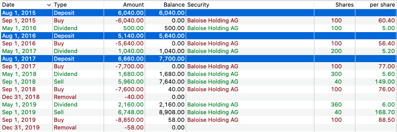

# employee incentive plan

Reading the plain numbers of an share-based payment plan e.g. within the Baloise Group [financial statements](https://www.baloise.com/en/home/investors/publications/financial-statements.html) and [annual report](https://www.baloise.com/dam/baloise-com/documents/de/publikationen/jahresabschluss/2018/annual-report-baloise-group-2018.pdf) section 18.4 (page 225) can be pretty tough.

Hence this repository (visually and interactively) demonstrates some of the potential outcomes of such a plan by using the [open-source](https://en.wikipedia.org/wiki/Open_source) tool [Portfolio Performance](https://www.portfolio-performance.info).

# disclaimer

The following information are for demonstration purposes only. Yet they are derived from the actual annual report data.

## this is not an investment advice

## the calcualations do not include any fee or tax calculations / deductions which would definitely make a difference.

## this project is currently under construction and may change significantly at any point in time

# idea(s)

## 01

### → [example XML for portfolio performance](eip/portfolio-performance.xml)

Invest (as an employee) annually (once a year) into [Baloise Holding AG (BALN.SW)](https://finance.yahoo.com/quote/BALN.SW/profile/).

Invest a [minimum of three years](https://en.wikipedia.org/wiki/Lock-up_period) (in the following example starting in 2015) in a row and use [dividends](https://en.wikipedia.org/wiki/Dividend) and partial share selling to buy new shares each year.

### performance

#### relativ

#### absolute

# data

All historical data within portfolio performance is taken from Yahoo Finance.
